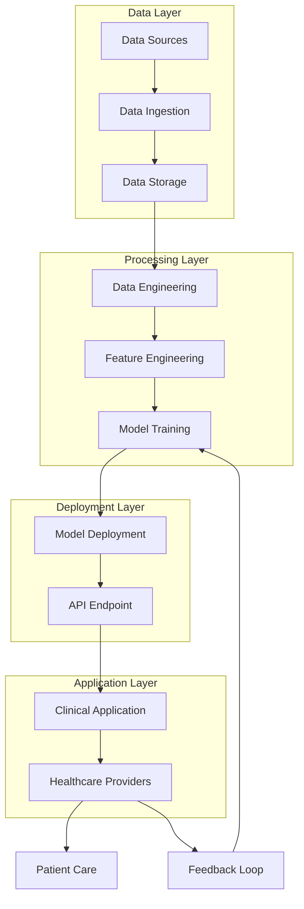
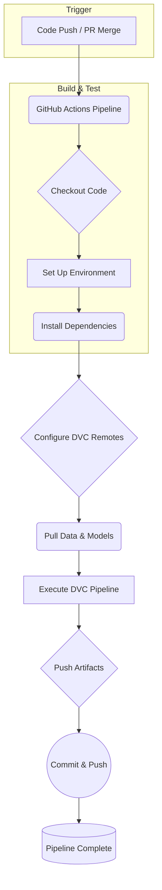
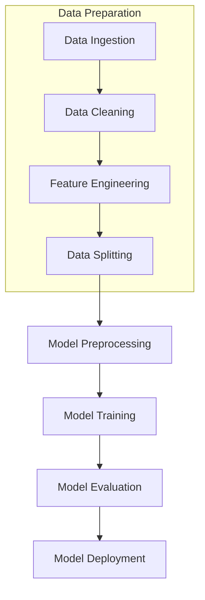

# Diabetic Readmission Risk Prediction

---

## Status

[](https://opensource.org/licenses/MIT)

[](https://app.codacy.com/gh/aai540-group3/project/dashboard?utm_source=gh&utm_medium=referral&utm_content=&utm_campaign=Badge_grade) [](https://github.com/aai540-group3/project/actions/workflows/codeql.yml) [](https://github.com/aai540-group3/project/actions/workflows/codacy-analysis.yml) [](https://github.com/aai540-group3/project/actions/workflows/dependabot/dependabot-updates)

[](https://github.com/aai540-group3/project/actions/workflows/mlops-pipeline.yml) [](https://github.com/aai540-group3/project/actions/workflows/generate-video.yml) [](https://github.com/aai540-group3/project/actions/workflows/generate-pdfs.yml) [](https://github.com/aai540-group3/project/actions/workflows/package-deliverables.yml) [](https://github.com/aai540-group3/project/actions/workflows/create-release.yml) [](https://github.com/aai540-group3/project/actions/workflows/deploy-tts-space.yml)

---

## ML System Design Document

---

Hospital readmissions are a critical issue affecting healthcare systems globally. Frequent readmissions, particularly within 30 days of discharge, not only escalate healthcare costs but also negatively impact patient satisfaction and clinical outcomes. Among chronic diseases, diabetes mellitus is prevalent and poses significant management challenges, leading to higher readmission rates. Effective strategies to predict and reduce readmissions among diabetic patients are essential for enhancing patient care and optimizing healthcare resources.

Machine learning offers robust tools to analyze large datasets and uncover patterns that may not be apparent through traditional statistical methods. By developing an ML system specifically designed to predict 30-day readmissions among diabetic patients, we aim to reduce unnecessary hospitalizations, lower healthcare costs, and improve patient outcomes. This document outlines the design and implementation of such a system, covering data sourcing, engineering, modeling, deployment, and monitoring, ensuring that each component aligns with industry best practices and ethical considerations.

---

## Table of Contents

- [Diabetic Readmission Risk Prediction](#diabetic-readmission-risk-prediction)
  - [Status](#status)
  - [ML System Design Document](#ml-system-design-document)
  - [Table of Contents](#table-of-contents)
  - [Mapping Proprietary AWS Tools to Open-Source Alternatives](#mapping-proprietary-aws-tools-to-open-source-alternatives)
    - [Tool Mapping Table](#tool-mapping-table)
    - [Additional Details](#additional-details)
      - [Model Development and Training](#model-development-and-training)
      - [Model Deployment](#model-deployment)
      - [CI/CD Pipelines](#cicd-pipelines)
      - [Feature Store and Model Registry](#feature-store-and-model-registry)
      - [Monitoring and Logging](#monitoring-and-logging)
    - [Notes on Implementation](#notes-on-implementation)
  - [Problem Statement](#problem-statement)
  - [Impact Measurement](#impact-measurement)
    - [Model Performance Metrics](#model-performance-metrics)
    - [Reduction in Readmission Rates](#reduction-in-readmission-rates)
    - [Cost Savings Analysis](#cost-savings-analysis)
    - [Resource Optimization](#resource-optimization)
  - [Security, Bias, and Ethical Considerations](#security-bias-and-ethical-considerations)
    - [Security Checklist](#security-checklist)
    - [Bias and Ethical Concerns](#bias-and-ethical-concerns)
  - [Solution Overview](#solution-overview)
    - [System Architecture](#system-architecture)
      - [System Architecture Diagram](#system-architecture-diagram)
    - [Data Sources](#data-sources)
      - [Dataset Characteristics](#dataset-characteristics)
      - [Versioning](#versioning)
    - [Data Engineering](#data-engineering)
      - [Ingestion](#ingestion)
      - [Cleaning](#cleaning)
      - [Splitting](#splitting)
    - [Feature Engineering](#feature-engineering)
      - [New Feature Creation](#new-feature-creation)
      - [Polynomial Features](#polynomial-features)
    - [Model Training and Evaluation](#model-training-and-evaluation)
      - [Models Implemented](#models-implemented)
      - [Evaluation Metrics and Results](#evaluation-metrics-and-results)
      - [Visualizations](#visualizations)
    - [Model Deployment](#model-deployment-1)
      - [Serialization and Versioning](#serialization-and-versioning)
      - [Infrastructure as Code](#infrastructure-as-code)
      - [Deployment Strategy](#deployment-strategy)
    - [Model Monitoring](#model-monitoring)
      - [DVCLive Integration](#dvclive-integration)
      - [DVC Studio Usage](#dvc-studio-usage)
      - [Automated Alerts and Retraining](#automated-alerts-and-retraining)
    - [Continuous Integration and Continuous Deployment (CI/CD)](#continuous-integration-and-continuous-deployment-cicd)
      - [GitHub Actions Workflow](#github-actions-workflow)
      - [CI/CD Pipeline Diagram](#cicd-pipeline-diagram)
      - [Benefits](#benefits)
  - [Repository Structure](#repository-structure)
  - [Architecture Diagrams](#architecture-diagrams)
    - [System Overview Diagram](#system-overview-diagram)
    - [Data Processing Pipeline](#data-processing-pipeline)
    - [CI/CD Pipeline](#cicd-pipeline)
    - [Model Deployment Architecture](#model-deployment-architecture)
  - [Conclusion](#conclusion)
  - [References](#references)

---

## Mapping Proprietary AWS Tools to Open-Source Alternatives

In the context of our AAI-540 Final Project, we are tasked with building a production-ready machine learning system without relying on proprietary services like AWS SageMaker. This guide maps AWS services to equivalent open-source tools that can be used to achieve similar functionalities.

---

### Tool Mapping Table

| **AWS Proprietary Tool**                                            | **Open-Source Equivalent**                          | **Description**                                                                                                                                                                                                                                                                             |
|---------------------------------------------------------------------|-----------------------------------------------------|---------------------------------------------------------------------------------------------------------------------------------------------------------------------------------------------------------------------------------------------------------------------------------------------|
| **AWS SageMaker Studio**                                            | **JupyterLab**                                      | Integrated development environment for machine learning. JupyterLab offers a web-based interactive development environment for notebooks, code, and data.                                                                                            |
| **AWS SageMaker Notebooks**                                         | **Jupyter Notebooks**                               | Interactive notebooks for data exploration and model development. Jupyter Notebooks are an open-source web application for creating and sharing documents containing live code and visualizations.                                                   |
| **AWS SageMaker Processing**                                        | **Apache Airflow, Luigi**                           | Managed service for running data processing jobs. Apache Airflow and Luigi are workflow management platforms for orchestrating complex computational workflows and data processing pipelines.                                                       |
| **AWS SageMaker Training**                                          | **TensorFlow, PyTorch, Scikit-learn**               | Managed service for training machine learning models. Open-source ML frameworks like TensorFlow, PyTorch, and Scikit-learn can be used for model training on local machines or cluster computing environments.                                        |
| **AWS SageMaker Debugger**                                          | **TensorBoard, PyTorch Profiler**                   | Tool for debugging and profiling ML models during training. TensorBoard and PyTorch Profiler provide visualization and tools for debugging and optimizing ML models.                                                                                 |
| **AWS SageMaker Model Registry**                                    | **MLflow Model Registry, DVC (Data Version Control)** | Central repository to store and version ML models. MLflow Model Registry and DVC are open-source tools for managing the full ML lifecycle, including model versioning and reproducibility.                                                          |
| **AWS SageMaker Deployment (Endpoints)**                            | **Flask, FastAPI, Docker, Kubernetes**              | Hosting ML models for real-time inference. Flask and FastAPI are web frameworks for serving models via RESTful APIs. Docker and Kubernetes can be used for containerization and orchestration of deployments.                                        |
| **AWS SageMaker Batch Transform**                                   | **Apache Spark, Dask**                              | For batch inference jobs on large datasets. Apache Spark and Dask are distributed computing frameworks suitable for large-scale data processing and batch inference tasks.                                                                           |
| **AWS SageMaker Pipelines (CI/CD)**                                 | **Kubeflow Pipelines, Jenkins, GitHub Actions, GitLab CI/CD** | Managed service for building and managing ML workflows. Kubeflow Pipelines, Jenkins, GitHub Actions, and GitLab CI/CD are open-source CI/CD tools for automating ML workflows and pipelines.                                     |
| **AWS SageMaker Feature Store**                                     | **Feast, Hopsworks Feature Store**                  | Centralized repository for storing and retrieving ML features. Feast and Hopsworks are open-source feature store implementations that manage feature data for training and serving.                                                                 |
| **AWS SageMaker Model Monitor**                                     | **Evidently AI, WhyLogs, DataValidation**           | Monitoring deployed ML models for concept drift and data quality. Evidently AI, WhyLogs, and Google's Data Validation library provide tools for monitoring and detecting anomalies in data and model predictions.                                    |
| **AWS CloudWatch (Infrastructure Monitoring)**                      | **Prometheus, Grafana**                             | Monitoring and observability of infrastructure and applications. Prometheus is an open-source monitoring system with a dimensional data model, and Grafana provides visualization dashboards for metrics collected by Prometheus.                     |
| **AWS CloudTrail (Logging and Auditing)**                           | **ELK Stack (Elasticsearch, Logstash, Kibana), Graylog** | Logging and auditing of user activity and API calls. The ELK Stack and Graylog are open-source platforms for log management and analytics.                                                                                                           |
| **AWS CodeCommit (Source Control)**                                 | **GitHub, GitLab, Bitbucket**                       | Source control service hosting private Git repositories. GitHub, GitLab, and Bitbucket offer Git repository hosting with additional features for collaboration and project management.                                                               |
| **AWS CodePipeline (CI/CD for Applications)**                       | **Jenkins, GitHub Actions, GitLab CI/CD**           | Continuous integration and delivery service for fast and reliable application updates. Jenkins, GitHub Actions, and GitLab CI/CD are open-source automation servers for building, testing, and deploying applications.                               |
| **AWS CodeBuild (Build Service)**                                   | **Jenkins, Travis CI, CircleCI**                    | Fully managed build service that compiles source code, runs tests, and produces software packages. Jenkins, Travis CI, and CircleCI are open-source tools for automating the software build process.                                                 |
| **AWS CodeDeploy (Automated Deployments)**                          | **Ansible, Puppet, Chef**                           | Automates code deployments to any instance, including EC2 instances and servers on-premises. Ansible, Puppet, and Chef are open-source configuration management tools that automate application deployment.                                          |
| **AWS Step Functions (Orchestration)**                              | **Apache Airflow, Luigi, Prefect**                  | Serverless orchestration service that lets you combine AWS services to build business-critical applications. Apache Airflow, Luigi, and Prefect are open-source platforms to programmatically author, schedule, and monitor workflows.               |
| **AWS IAM (Identity and Access Management)**                        | **Keycloak, Auth0 (open-source plan)**              | Manage access to AWS services and resources securely. Keycloak and Auth0 provide open-source identity and access management solutions for securing applications and services.                                                                        |
| **AWS S3 (Object Storage)**                                         | **MinIO, Ceph, HDFS**                               | Scalable storage in the cloud for data backup and distribution. MinIO and Ceph offer open-source object storage solutions compatible with S3 APIs. HDFS is the Hadoop Distributed File System for scalable storage and processing.                    |
| **AWS Lambda (Serverless Compute)**                                 | **OpenFaaS, Apache OpenWhisk**                      | Run code without provisioning or managing servers. OpenFaaS and Apache OpenWhisk are open-source serverless computing frameworks that let you run code in response to events.                                                                        |
| **AWS Kinesis (Real-time Data Streaming)**                          | **Apache Kafka, Apache Pulsar**                     | Collect, process, and analyze real-time, streaming data. Apache Kafka and Apache Pulsar are open-source distributed event streaming platforms capable of handling real-time data feeds.                                                              |
| **AWS Glue (Data Catalog and ETL)**                                 | **Apache NiFi, Apache Airflow, Talend Open Studio** | Extract, transform, and load (ETL) service for data preparation. Apache NiFi and Airflow can manage ETL workflows, while Talend Open Studio is an open-source data integration tool for ETL tasks.                                                   |
| **Amazon EMR (Managed Hadoop Framework)**                           | **Apache Hadoop, Apache Spark**                     | Provides a managed Hadoop framework to process vast amounts of data. Apache Hadoop and Spark can be set up on local clusters or cloud-based virtual machines to process large datasets.                                                              |
| **Amazon Athena (Serverless Query Service)**                        | **Presto, Apache Drill, Dask**                      | Interactive query service that makes it easy to analyze data directly in S3 using standard SQL. Presto and Apache Drill are open-source distributed SQL query engines. Dask can handle parallel computing for analytics on large datasets.            |
| **Amazon QuickSight (Business Intelligence)**                       | **Metabase, Apache Superset, Redash**               | Scalable business intelligence service with data visualization capabilities. Metabase, Apache Superset, and Redash are open-source BI tools for data exploration and visualization.                                                                  |
| **AWS Secrets Manager**                                             | **HashiCorp Vault, Doppler**                        | Protects secrets needed to access applications, services, and IT resources. HashiCorp Vault and Doppler are open-source tools for securely accessing and distributing secrets and credentials.                                                        |
| **AWS Config (Resource Inventory, Configurations, and Compliance)** | **Rudder, CFEngine**                                | Fully managed service providing an AWS resource inventory, configuration history, and configuration change notifications. Rudder and CFEngine are open-source configuration management and auditing tools.                                           |
| **Amazon CloudWatch Synthetics**                                    | **Selenium, Locust**                                | Monitors application endpoints and APIs to ensure they are reachable. Selenium can automate web browser interactions, and Locust is an open-source load testing tool that can monitor endpoints.                                                      |

---

### Additional Details

#### Model Development and Training

- **Proprietary**: AWS SageMaker provides managed instances for Jupyter notebooks and training jobs with built-in scalability.
- **Open-Source Alternative**: Use JupyterLab or VSCode for development, and frameworks like TensorFlow or PyTorch for model training. Training can be conducted locally or on cloud VMs; for scalability, leverage distributed training with libraries like Horovod.

#### Model Deployment

- **Proprietary**: AWS SageMaker Endpoints offer scalable model deployment with easy integration into applications.
- **Open-Source Alternative**: Containerize models using Docker and deploy using Flask or FastAPI. For scalability, orchestrate containers with Kubernetes or use serverless platforms like OpenFaaS.

#### CI/CD Pipelines

- **Proprietary**: AWS CodePipeline integrates with other AWS services for continuous integration and deployment.
- **Open-Source Alternative**: Use GitHub Actions, GitLab CI/CD, or Jenkins to automate testing, building, and deployment of code changes. These tools integrate well with Git repositories and support custom workflows.

#### Feature Store and Model Registry

- **Proprietary**: AWS SageMaker Feature Store and Model Registry manage features and models centrally.
- **Open-Source Alternative**: Implement a feature store using Feast to manage and serve features. Use MLflow for tracking experiments, storing model artifacts, and versioning models in the Model Registry.

#### Monitoring and Logging

- **Proprietary**: AWS CloudWatch provides logging and monitoring across AWS resources.
- **Open-Source Alternative**: Use Prometheus for metrics collection and Grafana for visualization dashboards. Implement logging with the ELK Stack, and monitor models with tools like Evidently AI.

---

### Notes on Implementation

- **Data Storage**: Instead of S3, data can be stored in local file systems or cloud storage services like Google Drive (with API integration) or open-source object storage like MinIO.

- **Security**: Implement security best practices by managing secrets with HashiCorp Vault and securing APIs with authentication mechanisms provided by frameworks like OAuth2 Proxy.

- **Infrastructure as Code**: Use tools like Terraform or Ansible to provision and manage infrastructure in a consistent and reproducible manner.

- **Container Orchestration**: For managing containers at scale, Kubernetes provides extensive features for deployment, scaling, and management of containerized applications.

- **Distributed Computing**: For large-scale data processing and training, consider setting up a Hadoop or Spark cluster using tools like Apache Hadoop or Dask for distributed computing.

---

## Problem Statement

The increasing rate of hospital readmissions poses a significant challenge to healthcare systems, leading to escalated costs and strained resources. For diabetic patients, the risk of readmission within 30 days of discharge is heightened due to factors such as the complexity of disease management, potential complications, and the necessity for strict adherence to treatment regimens.

The primary objective of this project is to develop a robust, scalable machine learning system capable of accurately predicting the likelihood of 30-day readmissions among diabetic patients. By analyzing a myriad of patient attributes—including demographics, medical history, treatment patterns, and hospital procedures—the system will generate predictions to inform clinical decision-making. Integrating this predictive capability into existing healthcare workflows aims to enable clinicians to proactively identify high-risk patients and tailor interventions to mitigate the risk of readmission.

---

## Impact Measurement

To assess the effectiveness of the ML system, we will employ a comprehensive set of metrics and analyses. These measures are designed to evaluate not only the technical performance of the model but also its real-world impact on healthcare delivery.

### Model Performance Metrics

The predictive accuracy and reliability of the model are critical for its adoption in clinical settings. We will utilize the following standard classification metrics:

- **Accuracy**: Measures the proportion of correct predictions out of all predictions.
- **Precision**: Assesses the model's ability to correctly identify true positive cases among all positive predictions.
- **Recall (Sensitivity)**: Evaluates the model's capacity to identify all actual positive cases.
- **F1-Score**: Represents the harmonic mean of precision and recall, providing a balance between the two.
- **ROC-AUC Score**: Quantifies the model's ability to distinguish between classes by plotting the true positive rate against the false positive rate.

These metrics will be calculated on a held-out test dataset to provide an unbiased evaluation of the model's performance.

### Reduction in Readmission Rates

A key goal of deploying the ML system is to achieve a measurable reduction in readmission rates among diabetic patients. We plan to:

- **Establish a Baseline**: Determine the current readmission rate prior to implementing the ML system.
- **Post-Implementation Monitoring**: Track readmission rates following deployment to assess changes.
- **Target Reduction**: Aim for at least a 10% decrease in 30-day readmission rates, indicating a significant positive impact.

Comparing these rates before and after implementation will help us assess the practical benefits of the system in a real-world healthcare environment.

### Cost Savings Analysis

Reducing readmissions can result in substantial cost savings for healthcare institutions. We will analyze:

- **Direct Cost Savings**: Calculate the reduction in expenses associated with fewer hospital stays, treatments, and procedures for readmitted patients.
- **Indirect Cost Savings**: Consider savings from improved resource allocation, such as reduced burden on hospital staff and facilities.
- **Return on Investment (ROI)**: Evaluate the financial benefits in relation to the costs incurred in developing and deploying the ML system.

This analysis will provide insights into the economic value of the system for healthcare providers.

### Resource Optimization

Efficient utilization of healthcare resources is essential for enhancing patient care while controlling costs. We will examine:

- **Bed Occupancy Rates**: Assess changes in bed availability and whether reduced readmissions lead to better management of hospital capacity.
- **Staff Workload**: Evaluate the impact on healthcare provider workloads, aiming for a more balanced distribution of patient care duties.
- **Preventive Care Allocation**: Observe whether resources can be reallocated towards preventive measures and patient education due to reduced readmissions.

By monitoring these indicators, we can validate the system's contribution to overall healthcare efficiency and patient care quality.

---

## Security, Bias, and Ethical Considerations

In developing an ML system for healthcare, it is imperative to address security, bias, and ethical concerns comprehensively. Patient data is sensitive and subject to strict regulations, and the ML models must be fair and transparent in their predictions.

### Security Checklist

- **Data Privacy Compliance**: Compliance with the Health Insurance Portability and Accountability Act (HIPAA) is mandatory. We will implement strict data governance policies to ensure patient confidentiality. Data de-identification techniques will remove personally identifiable information (PII), and any data sharing will adhere to consent agreements and legal requirements.

- **Secure Data Storage**: All data will be stored in encrypted Amazon S3 buckets using server-side encryption (SSE-S3). Access will be controlled through AWS Identity and Access Management (IAM) roles and policies, restricting permissions to authorized personnel only. Regular backups and recovery tests will prevent data loss.

- **Data Transmission Security**: We will enforce HTTPS protocols for all data transmission between services, utilizing SSL/TLS encryption to protect data in transit against interception and unauthorized access.

- **Access Control**: Role-Based Access Control (RBAC) will define user permissions based on specific roles and responsibilities. Regular audits of access logs will be conducted to detect and respond to any unauthorized activities.

- **Incident Response Plan**: A comprehensive incident response strategy will be developed, outlining procedures for incident detection, containment, eradication, recovery, and follow-up. Roles and responsibilities will be clearly defined to ensure an effective response to any security incidents.

### Bias and Ethical Concerns

- **Bias Identification and Mitigation**: We recognize the potential for biases related to age, gender, race, or socioeconomic status. Regular audits will be performed to detect such biases using techniques like Disparate Impact Analysis. If biases are identified, we will adjust training data and model parameters to ensure equitable treatment across all patient groups.

- **Model Explainability and Transparency**: To foster trust and facilitate clinical adoption, we will employ interpretable models or integrate explainability tools such as SHAP (SHapley Additive exPlanations). This approach provides clinicians with clear insights into the factors influencing each prediction.

- **Informed Consent and Data Usage**: Patient consent forms will include authorization for data usage in predictive modeling. Transparency about data collection methods, storage practices, and purposes will be maintained to build trust with patients and stakeholders.

- **Compliance with Ethical Guidelines**: The project will align with ethical standards set by professional bodies like the American Medical Association (AMA). Training will be provided to staff on data ethics, privacy, and responsible AI practices to cultivate an ethical culture.

By proactively addressing these considerations, we aim to build a system that is not only effective but also trustworthy and respectful of patient rights.

---

## Solution Overview

Our proposed solution integrates robust data handling, advanced modeling techniques, seamless deployment strategies, and continuous monitoring processes. Each component is designed to contribute to an effective and reliable ML system for predicting hospital readmissions.

### System Architecture

The overall architecture of the proposed ML system is designed to facilitate seamless data flow, robust model training, and efficient deployment. The system comprises multiple components, each responsible for specific tasks, integrated to function cohesively.

#### System Architecture Diagram



*Figure 1: System Overview Diagram illustrating the flow from data sources through model deployment to clinical application and feedback integration.*

### Data Sources

We utilize the **Diabetes 130-US hospitals for years 1999-2008 Data Set** from the UCI Machine Learning Repository, accessed via the Hugging Face Datasets library under the identifier `aai540-group3/diabetes-readmission`.

#### Dataset Characteristics

- **Size**: The dataset contains 101,766 patient records, providing a substantial sample for model training and evaluation.
- **Features**: It includes 55 attributes encompassing demographics (age, gender, ethnicity), medical history (diagnoses, comorbidities), laboratory results, medications, and hospitalization details (length of stay, number of procedures).
- **Target Variable**: The `readmitted` indicator (0 or 1) signifies whether a patient was readmitted within 30 days of discharge.

#### Versioning

- **Consistency**: The dataset is versioned (`v1.0`) to ensure consistency and reproducibility across different experiments and development stages.
- **Storage**: Raw data is stored in a structured format within the repository (`data/raw/data.csv`), enabling version control through tools like Git and DVC (Data Version Control).

### Data Engineering

Effective data engineering is crucial for preparing the dataset for modeling. Our process entails data ingestion, cleaning, and splitting.

#### Ingestion

Using the custom script `ingestion.py`, we perform the following steps:

- **Data Loading**: Employ the Hugging Face Datasets API to reliably fetch the dataset.
- **Data Export**: Save the dataset as a CSV file in the `data/raw` directory, facilitating version control and transparency.
- **Logging**: Implement logging mechanisms to document the ingestion process, ensuring traceability and facilitating debugging if anomalies arise.

#### Cleaning

The `cleaning.py` script addresses data quality issues to enhance model performance:

- **Duplicate Removal**: Identified and removed 1,437 duplicate entries to prevent data redundancy and bias.
- **Missing Values Handling**:
  - **Numerical Variables**: Imputed missing values using the median, reducing the impact of outliers and skewed distributions.
  - **Categorical Variables**: Filled missing values with the mode (most frequent value), maintaining category integrity.
- **Data Type Consistency**:
  - Converted numerical features to `float32` for computational efficiency.
  - Transformed binary categorical features into boolean types for clarity and proper handling in modeling.
- **Feature Reduction**:
  - Removed features with more than 50% missing data, such as 'weight' and 'payer_code', to avoid introducing bias or noise.
  - Eliminated irrelevant identifiers (e.g., patient IDs) to prevent data leakage and protect privacy.
- **Normalization and Standardization**: Applied where appropriate to ensure that features are on comparable scales, which is beneficial for certain algorithms.

#### Splitting

The `splitting.py` script divides the dataset into training and testing sets:

- **Training Set**: Consists of 80% of the data, used for model training.
- **Testing Set**: Comprises 20% of the data, reserved for evaluating model performance.
- **Stratification**: Ensured that the distribution of the target variable (`readmitted`) is consistent across both sets, maintaining the representativeness of the sample.
- **Reproducibility**: Used a fixed `random_state=42` to enable consistent results in subsequent runs, facilitating collaboration and comparison.

### Feature Engineering

Effective feature engineering can significantly enhance model performance by creating new variables that capture underlying relationships in the data.

#### New Feature Creation

Using `build_features.py`, we engineered several new features:

1. **Total Procedures (`total_procedures`)**:
   - **Definition**: Sum of `num_lab_procedures` and `num_procedures`.
   - **Rationale**: Represents the overall procedural burden during hospitalization, potentially correlating with readmission risk due to increased complexity or severity.

2. **Total Visits (`total_visits`)**:
   - **Definition**: Sum of `number_outpatient`, `number_emergency`, and `number_inpatient`.
   - **Rationale**: Reflects the frequency of healthcare interactions, which may indicate chronic conditions or issues with disease management.

3. **Average Procedures per Visit (`avg_procedures_per_visit`)**:
   - **Definition**: `total_procedures` divided by `total_visits`, carefully handling divisions by zero.
   - **Rationale**: Provides insight into procedural intensity per visit, highlighting patients who may be undergoing extensive interventions.

4. **Lab Procedure Ratio (`lab_procedure_ratio`)**:
   - **Definition**: `num_lab_procedures` divided by `total_procedures`, adjusting for zero totals.
   - **Rationale**: Indicates the focus on diagnostic procedures versus therapeutic interventions.

5. **Medication Intensity (`medication_intensity`)**:
   - **Definition**: `num_medications` divided by `time_in_hospital`.
   - **Rationale**: Captures the rate at which medications are administered, possibly correlating with treatment aggressiveness or complexity.

#### Polynomial Features

To capture non-linear relationships, we introduced polynomial features:

- **Implementation**: Used Scikit-learn's `PolynomialFeatures` with a degree of 2.
- **Application**: Applied to selected numerical features based on their correlation with the target variable.
- **Advantages**: Allows the model to learn complex patterns that linear features might not capture.
- **Considerations**: Monitored for potential issues such as multicollinearity and overfitting; performed feature selection post-generation to retain only those features contributing positively to model performance.

### Model Training and Evaluation

The modeling phase involved training two distinct models: Logistic Regression and AutoGluon's TabularPredictor. Both models were evaluated to determine their effectiveness.

#### Models Implemented

1. **Logistic Regression**

   - **Algorithm**: Utilized Scikit-learn's `LogisticRegression`, known for its simplicity and interpretability.
   - **Hyperparameters**:
     - **Penalty**: L2 regularization to prevent overfitting.
     - **Solver**: 'lbfgs', suitable for smaller datasets and supports L2 regularization.
     - **Max Iterations**: Set to 1000 to ensure convergence, especially important given the complex feature set.
     - **Random State**: Set to 42 for reproducibility.
   - **Preprocessing Steps**:
     - **Scaling**: Applied `StandardScaler` to standardize numerical features.
     - **Imputation**: Used `SimpleImputer` to handle missing values.
     - **Encoding**: Employed one-hot encoding for categorical variables.
   - **Training Process**:
     - Loaded preprocessed training data from `data/processed/logistic_regression/train_preprocessed.csv`.
     - Trained the model and saved it as `models/logistic_regression/model.pkl`.

2. **AutoGluon TabularPredictor**

   - **Algorithm**: Leveraged AutoGluon's automated machine learning capabilities to systematically explore various models and hyperparameters.
   - **Configuration**:
     - **Presets**: Set to 'best_quality' to prioritize predictive performance.
     - **Time Limit**: Restricted to 3600 seconds to balance computational resources and exploration depth.
     - **Hyperparameters**: Customized settings for Gradient Boosting Machines (GBM) with `num_boost_round` set to 100.
     - **Verbosity**: Level 2 to provide detailed logs during training.
   - **Automated Processing**:
     - AutoGluon handles missing values, categorical encoding, and feature scaling internally.
   - **Training Process**:
     - Used the raw training data (`data/processed/train.csv`).
     - Trained models are stored under `models/autogluon/`.

#### Evaluation Metrics and Results

Both models were evaluated on the test set, yielding the following results:

| **Metric** | **Logistic Regression** | **AutoGluon** |
| ---------- | ----------------------- | ------------- |
| Accuracy   | 46.01%                  | 63.30%        |
| Precision  | 69.49%                  | 63.18%        |
| Recall     | 46.01%                  | 63.30%        |
| F1-Score   | 46.01%                  | 63.30%        |
| ROC-AUC    | 64.65%                  | 68.09%        |

**Analysis**:

- **AutoGluon Performance**: Demonstrated superior performance across most metrics compared to Logistic Regression. The higher accuracy and ROC-AUC indicate better overall predictive ability.
- **Logistic Regression**: Achieved higher precision, suggesting it was better at predicting positive cases when it predicted them but had lower recall and overall accuracy.
- **ROC-AUC Improvement**: AutoGluon's ROC-AUC of 68.09% shows better discrimination between classes compared to Logistic Regression's 64.65%.

The results indicate that while both models have room for improvement, AutoGluon provides a better foundation for further development due to its higher accuracy and balanced performance across metrics.

#### Visualizations

To gain deeper insights into model behavior, we generated several visualizations:

- **Confusion Matrix**: Showed the model's performance in terms of true positives, true negatives, false positives, and false negatives.
- **ROC Curve**: Illustrated the trade-off between true positive rate and false positive rate at various thresholds.
- **Feature Importances**:
  - **Logistic Regression**: Analyzed coefficients to understand the impact of each feature.
  - **AutoGluon**: Used built-in methods to extract and plot feature importance rankings.

### Model Deployment

#### Serialization and Versioning

- **Model Saving**:
  - **Logistic Regression**: Serialized using `joblib` for efficient storage and loading.
  - **AutoGluon**: Utilized AutoGluon's `.save()` and `.load()` methods.
- **Version Control with DVC**:
  - Managed datasets and models using DVC to track changes and maintain consistency.
  - Configured remote storage on AWS S3 to handle large files and facilitate collaboration.

#### Infrastructure as Code

- **Terraform Configuration**:
  - Defined infrastructure resources (e.g., AWS S3 buckets, IAM policies) using Terraform scripts in the `terraform/` directory.
  - Enabled reproducible, version-controlled infrastructure provisioning.

#### Deployment Strategy

- **Deployment Architecture Diagram**

  ```mermaid
    flowchart TD
        subgraph "Deployment Pipeline"
            A["Model Artifacts"] --> B["Containerization"]
            B --> C["Docker Image"]
            C --> D["Deployment Service"]
            D --> E["API Endpoint"]
        end
        subgraph "Integration"
            E --> F["Clinical Applications"]
            F --> G["End Users (Clinicians)"]
        end
        G --> H["Patient Care"]
        G --> I["Feedback Loop"] --> A
  ```

  *Figure 2: Deployment Architecture Diagram showing the transition from model artifacts to deployment and integration with clinical applications.*

- **Endpoint Exposure**:
  - Plan to deploy the model as a RESTful API, making it accessible for integration with hospital systems.
  - Utilize AWS services like SageMaker or containerization technologies (Docker, Kubernetes) for scalability and ease of management.

- **Integration with Clinical Workflows**:
  - Collaborate with IT departments to incorporate the model's predictions into Electronic Health Record (EHR) systems.
  - Ensure outputs are presented in a user-friendly manner, facilitating clinicians' ability to act on the predictions.

### Model Monitoring

#### DVCLive Integration

- **Real-Time Tracking**:
  - Incorporated DVCLive to log metrics, parameters, and artifacts during training and evaluation.
  - Stored logs in the `dvclive/` directory for easy access and visualization.

#### DVC Studio Usage

- **Experiment Management**:
  - Connected the repository to DVC Studio for interactive dashboards.
  - Enabled comparison of experiments, tracking of model performance over time, and identification of trends.

#### Automated Alerts and Retraining

- **Performance Monitoring**:
  - Established thresholds for key metrics to detect when model performance degrades.
  - Configured alerts using AWS CloudWatch and SNS to notify the team promptly.
- **Data Drift Detection**:
  - Implemented mechanisms to identify changes in data distributions that could impact model validity.
  - Scheduled periodic retraining and evaluation to ensure the model remains accurate and relevant.

### Continuous Integration and Continuous Deployment (CI/CD)

#### GitHub Actions Workflow

The CI/CD pipeline, defined in `.github/workflows/mlops-pipeline.yml`, automates the development process.

**Pipeline Stages**:

1. **Trigger Conditions**:
   - Initiated on code pushes to the `main` branch or upon pull request merges involving relevant files.
2. **Environment Setup**:
   - Checks out the repository using `actions/checkout`.
   - Sets up Python 3.11 environment with `actions/setup-python`.
   - Installs project dependencies specified in `requirements.txt`.
3. **DVC Configuration**:
   - Configures DVC remotes to connect to AWS S3 storage.
   - Pulls data and models using `dvc pull`.
4. **Pipeline Execution**:
   - Runs DVC pipeline stages defined in `dvc.yaml` using `dvc exp run --run-all`.
   - Captures outputs, metrics, and artifacts.
5. **Artifacts Management**:
   - Pushes updated data and models to remote storage using `dvc push`.
   - Commits changes to relevant files back to the repository.
6. **Automated Commits**:
   - Utilizes `git-auto-commit-action` to automate the commit process.

#### CI/CD Pipeline Diagram



*Figure 3: CI/CD Pipeline Diagram illustrating the automated steps from code changes to updated models and data in the repository.*

#### Benefits

- **Automation**: Streamlines repetitive tasks, allowing the team to focus on development and improvement.
- **Reproducibility**: Ensures every run is documented and can be replicated, enhancing reliability and trust.
- **Collaboration**: Facilitates teamwork by maintaining a consistent codebase and artifact versions.

---

## Repository Structure

The repository is organized to promote clarity and ease of navigation, adhering to standard practices for ML projects.

```plaintext
project/
├── .github/                          # GitHub repository configurations
│   └── workflows/                    # GitHub Actions workflows
│       └── mlops-pipeline.yml        # CI/CD workflow configuration (GitHub Actions)
├── configs/                          # Configuration files for the project
│   ├── config.yaml                   # Main configuration file (project-wide settings)
│   ├── data/                         # Data-related configurations
│   │   └── diabetes.yaml             # Dataset-specific configurations (e.g., diabetes dataset)
│   ├── feature_engineering/          # Feature engineering configurations
│   │   └── base.yaml                 # Base feature engineering configuration
│   ├── model/                        # Model-specific configurations
│   │   ├── logistic_regression.yaml  # Configuration for logistic regression model
│   │   └── autogluon.yaml            # Configuration for AutoGluon model
│   └── training/                     # Training configurations
│       └── base.yaml                 # Base training hyperparameters
├── data/                             # Data storage
│   ├── raw/                          # Original, unprocessed data
│   ├── interim/                      # Intermediate data after cleaning/preprocessing
│   └── processed/                    # Data processed and ready for model training
├── models/                           # Trained model artifacts
│   ├── logistic_regression/          # Logistic Regression model
│   │   └── model.pkl                 # Saved Logistic Regression model
│   └── autogluon/                    # AutoGluon model
│       └── model.pkl                 # Saved AutoGluon model
├── reports/                          # Reports and analysis outputs
│   ├── figures/                      # Generated figures and visualizations
│   └── metrics/                      # Model evaluation metrics
├── src/                              # Source code for the project
│   ├── data/                         # Data processing modules
│   │   ├── __init__.py               # Makes data a Python package
│   │   ├── ingestion.py              # Data ingestion logic
│   │   ├── cleaning.py               # Data cleaning and preprocessing
│   │   ├── build_features.py         # Feature engineering logic
│   │   └── splitting.py              # Data splitting (train/test/validation)
│   ├── models/                       # Model training and evaluation modules
│   │   ├── __init__.py               # Makes models a Python package
│   │   ├── logistic_regression/      # Logistic Regression model
│   │   │   ├── train.py              # Training script for Logistic Regression
│   │   │   ├── evaluate.py           # Evaluation script for Logistic Regression
│   │   │   └── preprocessing.py      # Preprocessing specific to Logistic Regression
│   │   └── autogluon/                # AutoGluon model
│   │       ├── train.py              # Training script for AutoGluon
│   │       ├── evaluate.py           # Evaluation script for AutoGluon
│   │       └── preprocessing.py      # Preprocessing specific to AutoGluon
│   └── visualization/                # Visualization modules
│       ├── __init__.py               # Makes visualization a Python package
│       └── visualize.py              # Script for creating visualizations
├── dvc.yaml                          # DVC pipeline configuration file
├── dvc.lock                          # DVC lock file (tracks data and pipeline state)
├── requirements.txt                  # Python project dependencies
├── README.md                         # Project documentation and instructions
├── Makefile                          # Makefile for automation tasks (e.g., build, test)
└── terraform/                        # Infrastructure as Code (IaC) using Terraform
    ├── main.tf                       # Main Terraform configuration file
    └── variables.tf                  # Terraform variables
```

This structure ensures:

- **Separation of Concerns**: Code, configurations, data, models, and documentation are organized into distinct directories.
- **Version Control**: Git tracks code changes, while DVC handles large data files and models.
- **Reproducibility**: Scripts are parameterized and configurable via YAML files, promoting consistent execution across environments.

---

## Architecture Diagrams

Visual representations of the system components and workflows help in understanding the overall architecture.

### System Overview Diagram

*Refer to Figure 1 in the Solution Overview section.*

### Data Processing Pipeline



*Figure 4: Data Processing Pipeline showing the progression from raw data ingestion to model deployment.*

### CI/CD Pipeline

*Refer to Figure 3 in the Continuous Integration and Continuous Deployment section.*

### Model Deployment Architecture

*Refer to Figure 2 in the Model Deployment section.*

---

## Conclusion

This design document presents a comprehensive machine learning system aimed at predicting 30-day hospital readmissions for diabetic patients. By integrating advanced data engineering practices, sophisticated modeling techniques, and robust deployment strategies, the proposed solution is poised to make a significant impact in healthcare settings.

Emphasis on security, ethical considerations, and bias mitigation ensures that the system not only performs effectively but also responsibly. The use of tools like DVC and Terraform enhances reproducibility and scalability. Additionally, automated CI/CD pipelines facilitate continuous improvement and collaboration.

Moving forward, collaboration with healthcare professionals will be crucial to refine the system, ensuring that it integrates seamlessly into clinical workflows and truly enhances patient care.

---

## References

- **[1] UCI Machine Learning Repository**: "Diabetes 130-US hospitals for years 1999-2008 Data Set." [Online]. Available: [https://archive.ics.uci.edu/ml/datasets/diabetes+130-us+hospitals+for+years+1999-2008](https://archive.ics.uci.edu/ml/datasets/diabetes+130-us+hospitals+for+years+1999-2008)

- **[2] Health Insurance Portability and Accountability Act (HIPAA)**: U.S. Department of Health & Human Services. [Online]. Available: [https://www.hhs.gov/hipaa/index.html](https://www.hhs.gov/hipaa/index.html)

- **[3] American Medical Association (AMA) Code of Medical Ethics**: AMA Ethical Guidelines. [Online]. Available: [https://www.ama-assn.org/delivering-care/ethics/code-medical-ethics-overview](https://www.ama-assn.org/delivering-care/ethics/code-medical-ethics-overview)

- **[4] AutoGluon Documentation**: AutoGluon TabularPredictor. [Online]. Available: [https://auto.gluon.ai/stable/tutorials/tabular_prediction/index.html](https://auto.gluon.ai/stable/tutorials/tabular_prediction/index.html)

- **[5] DVC (Data Version Control)**: DVC Documentation. [Online]. Available: [https://dvc.org/doc](https://dvc.org/doc)

- **[6] Terraform**: Terraform by HashiCorp. [Online]. Available: [https://www.terraform.io/](https://www.terraform.io/)
