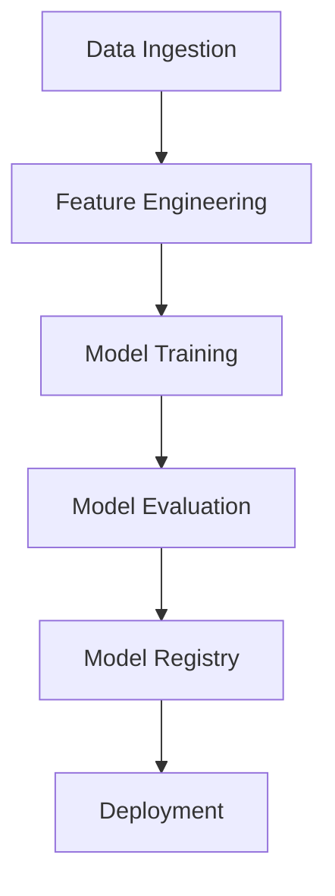

# System Architecture

## Overview

The system uses a modular architecture with clear separation of concerns:

### Components

#### Data Pipeline

- Data ingestion from UCI repository
- Feature engineering with Feast
- Data quality monitoring

#### Model Pipeline

- Multiple model implementations
- Hyperparameter optimization
- Model evaluation and selection

#### Deployment Pipeline

- Model serving with FastAPI
- Performance monitoring
- Resource monitoring

### Infrastructure

- AWS S3 for storage
- DynamoDB for feature store
- CloudWatch for monitoring

### Security

- IAM roles for access control
- Encryption at rest and in transit
- Regular security scanning
